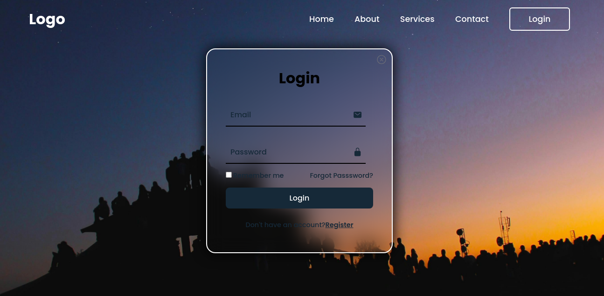
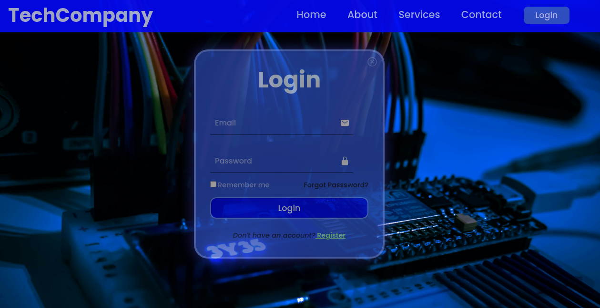

# Floating Login Form
Lets create a basic floating login form alongside a home page template

# Branches dev1, dev2 and Joint
These Branches contain the same changes and look as follow:

# Branches QA and Main
These last two Branches have the final touches on the UI and UX of our floating Login/SignUp form
This is how it looks like:

